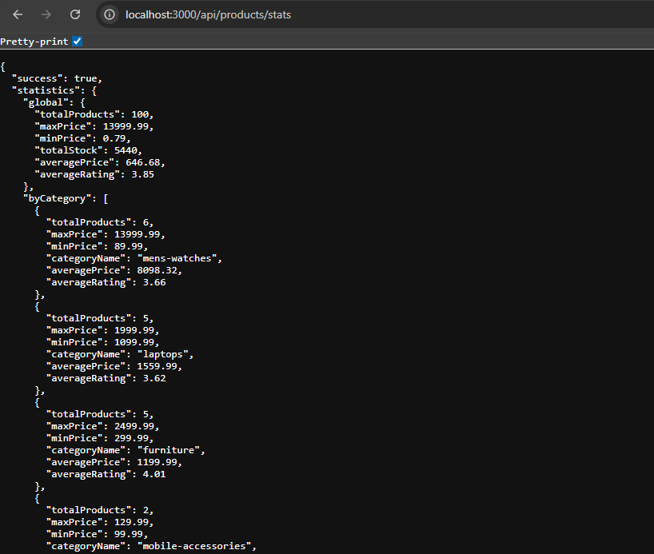
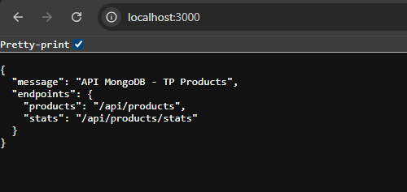

# TP Node.js MongoDB Client - Guide Complet

## Installation

```npm install```

## Fonctionnalités implémentées

### Routes disponibles:

1. **GET /api/products** - Liste des produits avec:
   - Pagination: `?page=1&limit=10`
   - Filtrage: `?category=smartphones`
   - Recherche: `?search=iphone`
   - Tri: `?sort=price` ou `?sort=-price`
   

2. **GET /api/products/stats** - Statistiques agrégées:
   - Statistiques par catégorie
   - Top 5 produits (prix > 500$)
   - Analyse par marque
   

## Utilisation

### 1. Démarrer MongoDB
```mongod```

### 2. Peupler la base de données
```npm run seed```

### 3. Démarrer le serveur
```npm start```



